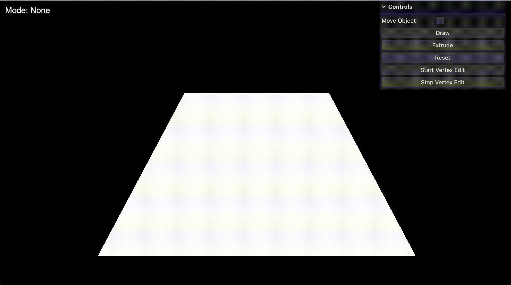
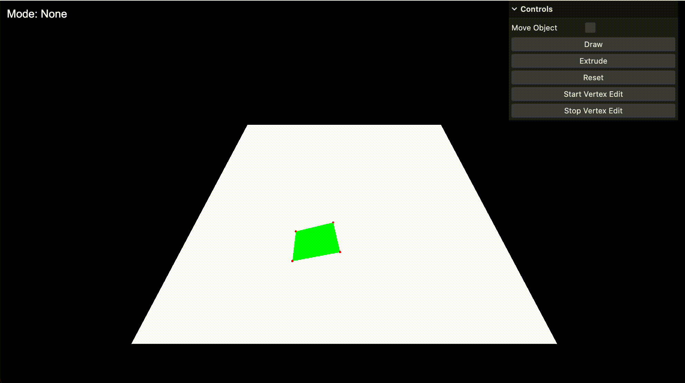
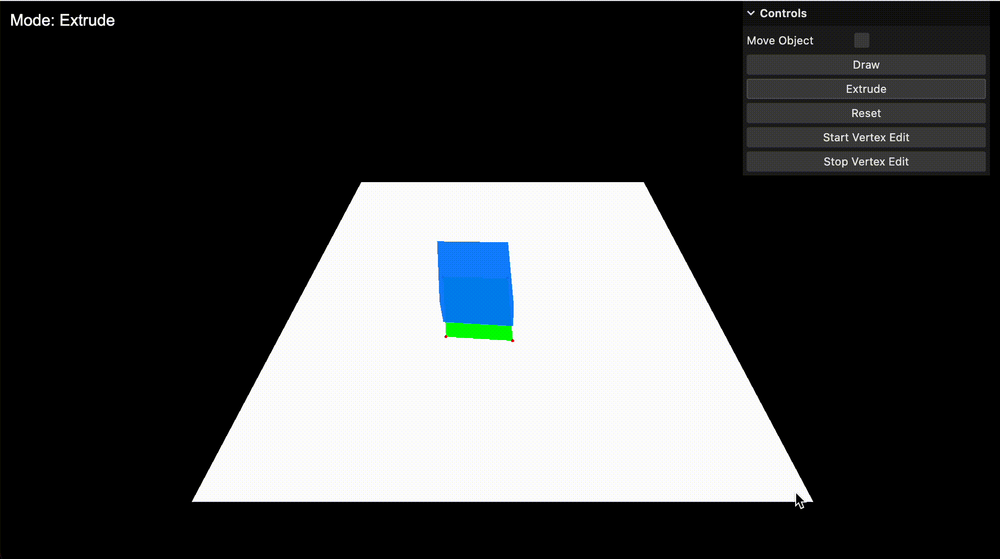
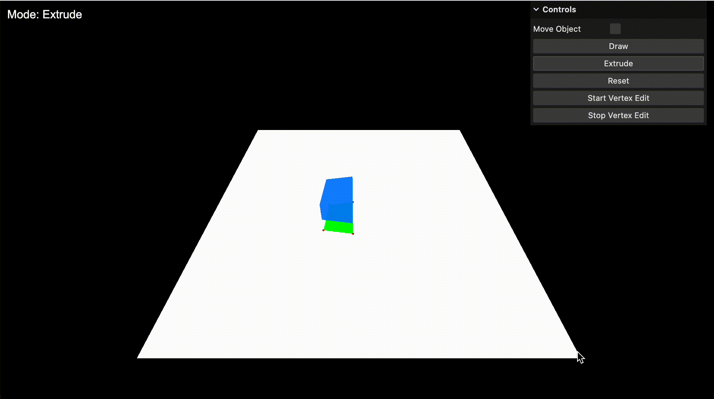

# Snaptrude Assignment

See deployed project [here](https://snaptrude-task.vercel.app/)

## Setup

Ensure that node is installed in your system.

Run the following commands to setup and run this project locally

```bash
# Install dependencies (only the first time)
npm install

# Starts the local development server with the project running
npm run dev
```

## Key Features

- **Draw Mode**: Click to add points, double-click or right-click to complete the shape.
- **Extrude**: Convert the last drawn 2D shape into a 3D object.
- **Move Object**: Toggle to enable dragging of 3D objects.
- **Vertex Edit**: Enter a mode where individual vertices can be selected and moved.
- **Reset**: Clear the scene and start over.

## Demo / Usage Examples

### 1. Drawing a 2D shape

> Note: After setting all the dots, Double-Click or Right-Click to completely draw the shape on the canvas



### 2. Extruding a shape into 3D



### 3. Moving the 3D object



### 4. Editing vertices

> Note: Make sure the "Move Object" checkmark is ticked OFF during vertex edit mode



## Project Structure

```zsh
.
├── package-lock.json       # Locks the versions of npm dependencies
├── package.json            # Defines project metadata and dependencies
├── readme.md               # Project documentation and instructions
├── src                     # Source code directory
│   ├── dragControls.js     # Handles dragging of 3D objects
│   ├── extrusion.js        # Manages 2D to 3D shape extrusion
│   ├── gui.js              # Sets up the graphical user interface
│   ├── index.html          # Main HTML file for the web application
│   ├── main.js             # Entry point of the application
│   ├── scene.js            # Sets up the Three.js scene, camera, and renderer
│   ├── shapes.js           # Manages 2D shape drawing functionality
│   ├── style.css           # CSS styles for the application
│   ├── utils.js            # Utility functions used across the application
│   └── vertexEdit.js       # Handles vertex editing of 3D objects
├── static                  # Directory for static assets
└── vite.config.js          # Configuration file for Vite build tool
```

## File Descriptions

- `main.js`: Entry point of the application, sets up the 3D environment and initializes all modules.
- `scene.js`: Handles the Three.js scene setup, including camera and lighting.
- `shapes.js`: Manages the drawing of 2D shapes on the plane.
- `extrusion.js`: Contains logic for extruding 2D shapes into 3D objects.
- `dragControls.js`: Implements the ability to drag 3D objects in the scene.
- `vertexEdit.js`: Provides functionality for editing individual vertices of 3D objects.
- `gui.js`: Sets up the user interface controls using lil-gui.
- `utils.js`: Contains utility functions used across the application.

## Dependencies

- Three.js: 3D graphics library
- lil-gui: For creating the graphical user interface

## Approach

Used the following example as references for creating the vertices:

- https://threejs.org/examples/#webgl_geometry_convex

Used the following example as reference for extrusion of geometry:

- https://threejs.org/docs/index.html?q=extr#api/en/geometries/ExtrudeGeometry

And obvioulsy, the threejs documentation and community forum.
